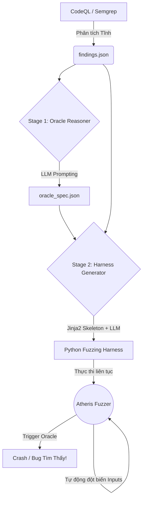

# Tổng quan về VulnHunterX: FuzzGen Framework

## 1. Giới thiệu

**FuzzGen** là một phân hệ tự động hóa cốt lõi thuộc dự án bảo mật **VulnHunterX**. Nó được thiết kế để giải quyết một trong những bài toán khó khăn nhất trong kiểm thử bảo mật động (Dynamic Application Security Testing - DAST): **Tự động sinh mã nguồn kịch bản kiểm thử (Fuzzing Harness) bằng Trí tuệ Nhân tạo.**

Thông thường, việc viết một harness cho fuzzer như `Atheris` đòi hỏi các kỹ sư bảo mật phải am hiểu sâu về mã nguồn mục tiêu, tìm ra điểm bắt đầu (entry point) lý tưởng, tự tay điền dữ liệu ngẫu nhiên (Fuzzed Data) vào các tham số, và xây dựng một cơ chế "Oracle" (điều kiện bắt lỗi) thủ công.

FuzzGen tự động hóa hoàn toàn quy trình này bằng việc kết hợp **Phân tích tĩnh (CodeQL/Semgrep)** với khả năng suy luận mạnh mẽ của **Large Language Models (LLMs)** qua thư viện trung gian `LiteLLM`.

---

## 2. Kiến trúc 2 Giai đoạn (Two-Stage Pipeline)

Hệ thống FuzzGen hoạt động mượt mà thông qua một quy trình nối tiếp gồm 2 giai đoạn chính, được decoupling (tách rời) rõ ràng để dễ dàng can thiệp và gỡ lỗi.

### Stage 1: Oracle Reasoner (Suy luận Điểm Bắt Lỗi)
Mục tiêu của giai đoạn này là thay thế "bộ não" của chuyên gia bảo mật để phân tích lỗ hổng:
1. **Đầu vào:** Nhận file `findings.json` (báo cáo mã lỗi phân tích tĩnh từ CodeQL) cùng với các file CSV rọi sáng cấu trúc hàm (`signatures_function.csv`, `functions.csv`).
2. **Suy luận (LLM):** LLM đóng vai trò như một chuyên gia bảo mật. Dựa vào Rule ID, Call Tree và Mô tả Data Flow, LLM sẽ suy luận ra:
   - Chiến lược nhồi dữ liệu (`input_strategy`: điền trực tiếp vào tham số hay giả lập qua Flask/Request).
   - Cơ chế kiểm thử (`monitor_strategy`: bắt lỗi qua giá trị trả về, hay chèn Mock/Patch call để theo dõi side-effect).
   - Dấu hiệu nhận biết lỗi (`trigger_patterns`).
3. **Đầu ra:** Ghi ra file `oracle_spec.json`. Đây là một bản thiết kế (blueprint) cấu trúc mô tả lại kịch bản tấn công ở cấp độ cao.

### Stage 2: Harness Generator (Sinh Mã Nguồn Fuzzing)
Mục tiêu là biên dịch `oracle_spec.json` thành mã Python chạy được:
1. **Tiền xử lý (Boilerplate):** Hệ thống không ép LLM viết tất cả từ con số không. Thay vào đó, nó sử dụng thư viện **Jinja2** (thông qua `base_harness.j2`) để tiền khởi tạo các phần mã chắc chắn đúng: các lệnh `import`, phần bọc `atheris.instrument_imports()`, và signature của hàm mục tiêu.
2. **Coding (LLM):** Một khung sườn (skeleton) với toàn bộ thông số kỹ thuật (được bọc trong bình luận - *Comment-as-spec*) sẽ được đẩy cho LLM thứ 2. LLM này đóng vai trò như là **Thợ lập trình hẹp (Narrow Coder)**, chỉ tập trung viết đúng duy nhất logic của thân hàm `TestOneInput`.
3. **Đầu ra:** Trả về file cấu trúc Python `harness_py_<rule_id>.py` đã hợp nhất hoàn toàn logic sinh FDP ngẫu nhiên, gọi hàm chuẩn xác và giám sát lỗi (Oracle check).

---

## 3. Quy trình Vận hành Toàn cảnh (Workflow)



---

## 4. Công nghệ Cốt lõi
* **Python (3.10+):** Ngôn ngữ trụ cột của toàn dự án bảo mật, tương thích sâu với các tệp thực thi.
* **Atheris Fuzzer:** Công cụ bảo mật dựa trên nhân LibFuzzer chuyên dùng cho mã nguồn Python do Google phát triển. Hỗ trợ dò tìm độ phủ (Coverage-guided).
* **LiteLLM:** Lớp Wrapper tuyệt vời giúp FuzzGen trở nên độc lập với bất kỳ nhà cung cấp Model AI nào (hỗ trợ Ollama Local, OpenAI, Google Gemini, Anthropic).
* **Jinja2:** Công cụ Template Engine linh hoạt đảm bảo phần khung sườn logic Python không bị mô hình ngôn ngữ làm hỏng (hallucinate).
* **PyYAML / JSON:** Chuẩn hóa giao tiếp giữa các tiến trình (Config Files & Specifications).

## 5. Giá trị Cốt lõi đem lại (Why FuzzGen?)
- **Độ tin cậy cao:** Giảm thiểu ảo giác của AI (Hallucination) do việc chia tách 2 nhiệm vụ "Suy luận suy nghĩ logic" (Stage 1) và "Cày code chi tiết" (Stage 2).
- **Phát hiện False-Positive:** Giúp kiểm duyệt chéo các lỗ hổng trên giấy từ CodeQL bằng môi trường thực tế (Runtime Executable).
- **Tốc độ:** Tự động tạo kịch bản chỉ trong vài giây, tiết kiệm nhiều giờ hay nhiều ngày so với việc Kỹ sư DAST trực tiếp mổ xẻ mã nguồn legacy.

---

## 6. Minh họa Dữ liệu (Examples)

Để giúp bạn hình dung rõ hơn về luồng dữ liệu trôi trong FuzzGen Pipeline, dưới đây là các dữ liệu đầu vào và đầu ra mẫu từ một lỗ hổng XSS (`py/bad-tag-filter`) trong bộ mã nguồn `superset`.

### A. file `findings.json` (Input từ CodeQL)
File JSON này là đầu vào tối thượng chứa mô tả chi tiết từ hệ thống CodeQL Semantic:
```json
{
  "finding": {
    "repo_name": "superset",
    "lang": "python",
    "rule_id": "py/bad-tag-filter",
    "function_name": "sanitize_svg_content",
    "file": "superset/utils/core.py",
    "message": "Sanitizing SVG content string with an incomplete regex filter.",
    "answers": [
      "svg_content",
      "svg_content flows into re.sub() replacement logic.",
      "Regular expression fails to strip malformed tags like `</script  >`.",
      "re.sub() sink mechanism outputting sanitized string.",
      "Attacker uploads malicious SVG bypassing filter to trigger Stored XSS."
    ]
  }
}
```

### B. file `signatures_function.csv` (Ngữ cảnh Static)
Cung cấp cho LLM Stage 1 bối cảnh về tham số và kiểu dữ liệu (Type Hint) của hàm mục tiêu:
```csv
name,file,start_line,end_line,param_name,param_type
sanitize_svg_content,superset/utils/core.py,124,142,svg_content,str
```

### C. file `oracle_spec.json` (Bản thiết kế Oracle)
Đây là sản phẩm tư duy của **LLM Stage 1** và sẽ làm đầu vào cho **Stage 2** (Verdict/Quyết định chốt hạ):
```json
{
  "oracle_type": "BAD_TAG_FILTER",
  "attack_scenario": "Attacker provides SVG with malformed script tags not filtered by regex",
  "tainted_params": [
    {
      "name": "svg_content",
      "index": 0,
      "type": "str"
    }
  ],
  "monitor": {
    "strategy": "inspect_return",
    "patch_target": null,
    "capture_what": "returned sanitized SVG content",
    "additional_imports": []
  },
  "oracle_check": {
    "condition_description": "Check if malformed script tags survive sanitization",
    "trigger_patterns": ["</script\\s*>"],
    "raise_type": "RuntimeError",
    "raise_message_template": "BAD_TAG_FILTER: Malformed script tag detected in sanitized SVG content"
  }
}
```

